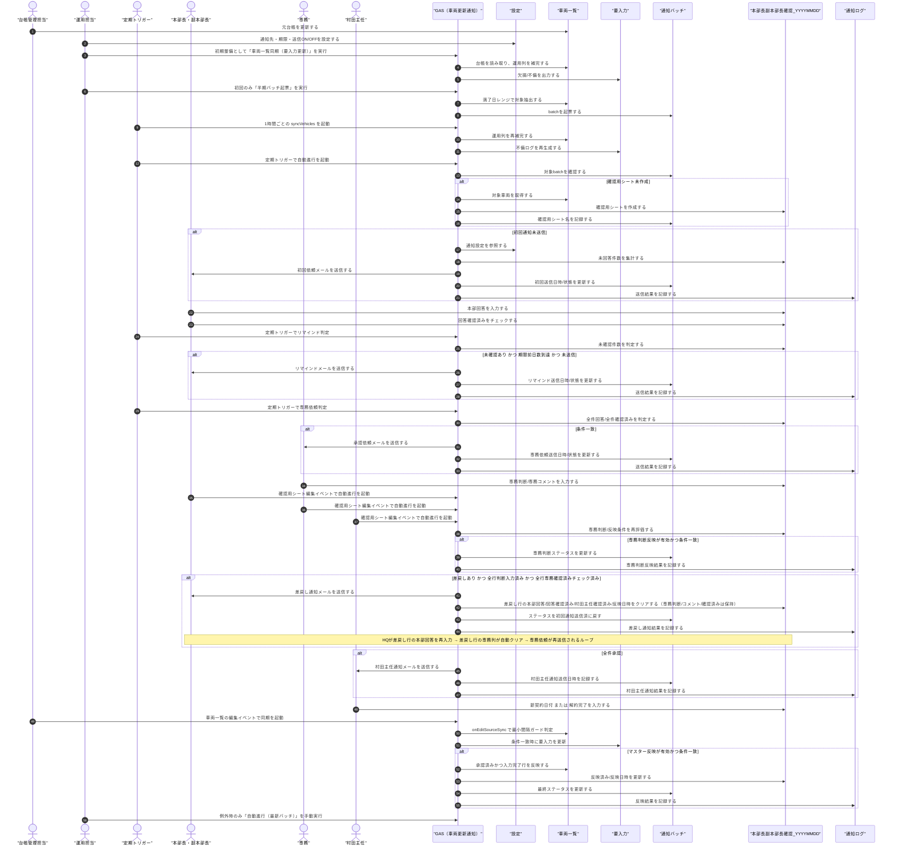
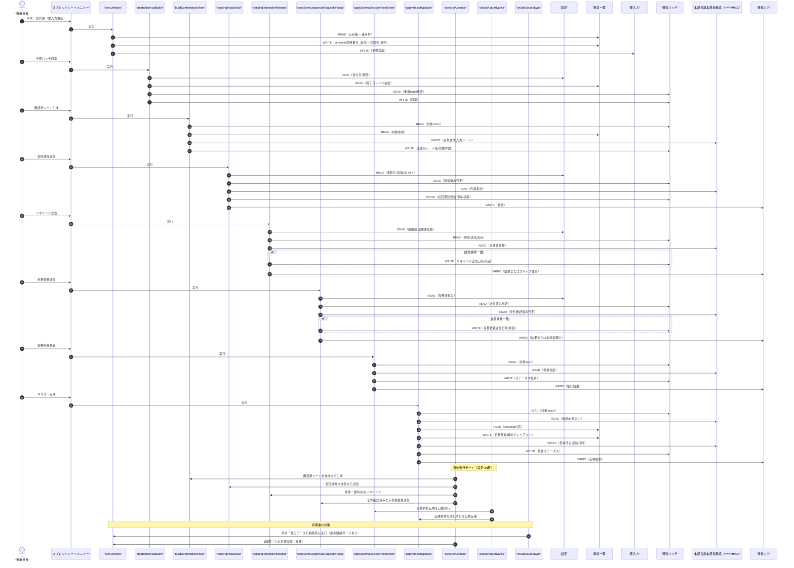

# シーケンス図: 車両リース更新通知（半期一括）

- 作成日: 2026-02-12
- 更新日: 2026-02-12
- 区分: 実装基準（現行コードの可視化）
- 対象コード: `/Users/yushi/work/work/クラハシ/src/main.ts`
- 目的: 「誰がどこを触るか」と「どの処理がどのシートを読み書きするか」を、業務フローとシステムフローの2視点で把握する

## 0. 背景（なぜ2種類の図に分けるか）

- 業務フロー図:
  - 人の役割と入力責任を確認するための図です。
- システムフロー図:
  - メニュー実行時に、どの関数がどのシートを読み書きするかを確認するための図です。

同じ処理でも、業務上の責任分界と、システム上の依存関係は見え方が違います。  
そのため、1枚に混ぜずに2枚へ分離しています。

## 1. 業務フロー図（誰がどこを触るか）

## 2. システムフロー図（どの処理がどのシートで動くか）

## 3. 補足（読み方）

- 業務フロー図:
  - 人が入力責任を持つ箇所と、運用担当が実行責任を持つ箇所を確認します。
- システムフロー図:
  - 影響調査時に「このメニュー実行で、どのシートが更新されるか」を確認します。
- 確認用シートが複数ある場合:
  - 正本は `通知バッチ.確認用シート名` に記録されたシートです。
