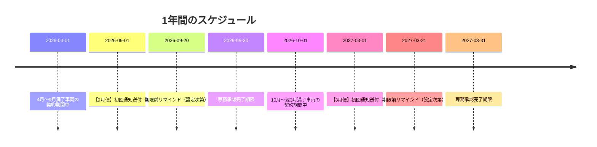
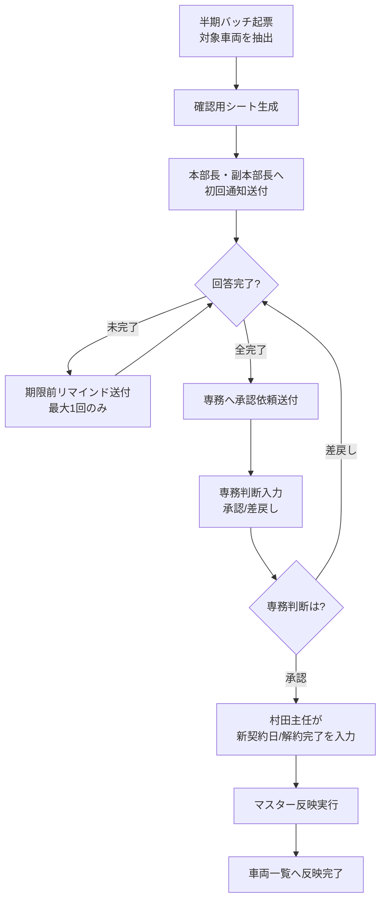

# 車両リース契約更新システム 運用マニュアル

このマニュアルは、車両リース契約の更新通知システムを使うための手順をまとめたものです。

---

## 目次

1. [このシステムでできること](#1-このシステムでできること)
2. [登場人物と役割](#2-登場人物と役割)
3. [1年間のスケジュール](#3-1年間のスケジュール)
4. [全体フロー](#4-全体フロー)
5. [各担当者の操作手順](#5-各担当者の操作手順)
6. [スプレッドシートと設定](#6-スプレッドシートと設定)
7. [自動進行モード](#7-自動進行モード)
8. [困ったときの対応](#8-困ったときの対応)
9. [やってはいけないこと](#9-やってはいけないこと)
10. [メニュー項目リファレンス](#10-メニュー項目リファレンス)

---

## 1. このシステムでできること

「**満了車両の更新/解約を、専務承認付きで一括処理する**」システムです。

1. 半期ごとの対象車両を自動抽出する
2. 本部長・副本部長へ一括で確認依頼を出す
3. 締切前に未回答時だけリマインドを送る
4. 全件確認完了で専務へ承認依頼を送る
5. 専務の承認後、車両一覧（マスター）へ反映する

---

## 2. 登場人物と役割

| 役割 | 誰か | 主な作業 |
| --- | --- | --- |
| **本部長・副本部長** | 各部門の責任者 | 満了車両について「更新」か「解約」かを判断する |
| **専務** | 全社の決定権者 | 本部回答を一括して「承認」か「差戻し」を判断する |
| **村田主任** | 実務担当者 | 承認済み車両について、新契約日や解約完了を入力する |
| **運用管理者** | システム管理者 | 通知先や締切日などを設定し、半期便を実行する |
| **台帳管理担当** | 車両データの管理者 | 車両一覧（元台帳）の事実データを管理する |

---

## 3. 1年間のスケジュール

このシステムは**年2回**、3月と9月に稼働します。

| 便名 | 対象期間 | 締切 |
| --- | --- | --- |
| **3月便** | 前年10月1日 〜 当年3月31日満了分 | 3月31日 |
| **9月便** | 4月1日 〜 9月30日満了分 | 9月30日 |

---

## 4. 全体フロー

| ステップ | 誰が | 何をするか | 自動/手動 |
| --- | --- | --- | --- |
| 半期バッチ起票 | 運用管理者 | 対象車両を抽出し通知バッチを作成 | 手動（半期一括実行） |
| 確認用シート生成 | システム | 本部長・副本部長用の入力シートを作成 | 自動 |
| 初回通知送付 | システム | 確認依頼メールを送付 | 自動 |
| 本部回答 | 本部長・副本部長 | 各車両の更新/解約を入力しチェック | 手動 |
| リマインド送付 | システム | 未回答時に1回だけ送付 | 自動（条件付き） |
| 専務承認依頼送付 | システム | 全件回答済みで専務へメール | 自動 |
| 専務判断 | 専務 | 承認または差戻し | 手動 |
| 最終入力 | 村田主任 | 新契約日/解約完了を入力 | 手動 |
| マスター反映 | システム | 車両一覧へ書き戻し | 自動 or 手動 |

---

## 5. 各担当者の操作手順

### 5.1 本部長・副本部長（一次確認者）

1. メールで送られるリンクから「確認用シート」を開く
2. 各車両について「本部回答」を入力する
   - `更新`：契約を継続する
   - `解約（入替）`：入替のために解約する
   - `解約（満了）`：満了のため解約する
3. 入力が終わった行の「回答確認済み」にチェックを入れる

**注意：全行にチェックが入らないと、専務依頼が送られません。**

---

### 5.2 専務（承認者）

1. メールで送られるリンクから「確認用シート」を開く
2. 各車両について「専務判断」を入力する
   - `承認`：本部回答通りに進める
   - `差戻し`：本部へ再検討を求める
3. 必要に応じて「専務コメント」を入れる

**注意：** 専務判断の列は保護されており、専務以外は編集できません。差戻しの場合、本部長・副本部長が再回答します。

---

### 5.3 村田主任（反映担当）

承認済みの車両について、次を入力します。

- **更新の場合：** `新契約開始日` と `新契約満了日`
- **解約の場合：** `解約完了` にチェック

入力が終わったら、自動または手動で「マスター反映」が実行されます。

---

### 5.4 運用管理者

#### 半期便ごとの作業

メニュー「**半期一括実行**」から次をまとめて実行します。

1. スキーマ同期
2. 車両一覧同期（要入力更新）
3. 半期バッチ起票
4. 初回通知送信
5. リマインド送信（条件一致時）
6. 専務依頼送信（全件確認後）

#### 定期的な確認

- 「通知ログ」シートで送信結果を確認
- 「設定」タブの内容が最新かどうかを確認

---

## 6. スプレッドシートと設定

### 6.1 シート一覧

| タブ名 | 役割 | 主に見る/触る人 |
| --- | --- | --- |
| **設定** | 通知先や締切日などの運用ルール | 運用管理者 |
| **車両一覧** | 元台帳であり最終反映先でもある唯一の正本 | 台帳管理担当 / システム |
| **通知バッチ** | 半期便の進捗を記録する台帳 | 運用管理者 |
| **本部長副本部長確認_YYYYMMDD** | 回答と承認の入力画面 | 本部長・副本部長 / 専務 / 村田主任 |
| **要入力** | 元台帳の不備（満了日なし等）の検出ログ | 台帳管理担当 |
| **通知ログ** | メール送信の記録 | 運用管理者 |

### 6.2 「設定」タブの項目

| 項目名 | 説明 | 例 |
| --- | --- | --- |
| `本部長副本部長_通知先To` | 初回通知・リマインドの送付先 | メールアドレス（カンマ区切りで複数可） |
| `専務_通知先To` | 専務承認依頼の送付先 | メールアドレス |
| `専務_通知先Cc` | 専務依頼のCC（任意） | メールアドレス |
| `半期送付日_3月` / `半期送付日_9月` | 各便の送付日 | 3月1日 / 9月1日 |
| `回答期限_3月` / `回答期限_9月` | 各便の締切日 | 3月31日 / 9月30日 |
| `リマインド_期限前日数` | 締切何日前にリマインドを送るか | 10 |
| `通知_メール送信` | メールを実際に送るか | TRUE / FALSE |
| `自動進行_有効` | 自動進行モードのON/OFF | TRUE / FALSE |
| `自動進行_定期実行_有効` | 定期トリガーで自動進行するか | TRUE / FALSE |
| `自動進行_編集連動_有効` | シート編集時に自動進行するか | TRUE / FALSE |
| `自動進行_専務判断反映_有効` | 専務判断反映を自動で行うか | TRUE / FALSE |
| `自動進行_マスター反映_有効` | マスター反映を自動で行うか | TRUE / FALSE |

---

## 7. 自動進行モード

条件を満たすと**自動的に次のステップに進む**機能です。運用管理者の手動操作を減らせます。

### トリガー

| トリガー種別 | 説明 |
| --- | --- |
| **定期トリガー** | 1時間ごとに実行し、条件を満たす処理を前進させる |
| **編集連動トリガー** | 確認用シートや車両一覧が編集された時に実行される |

### 自動進行の判定ルール

| 処理 | 自動で進む条件 |
| --- | --- |
| **リマインド送信** | 期限前日数に到達 かつ 未完了行あり かつ 当バッチで未送信 |
| **専務依頼送信** | 全行で「本部回答」入力済み かつ 全行で「回答確認済み」チェック済み |
| **マスター反映** | 専務判断が「承認」 かつ 必須入力完了（新契約日 または 解約完了チェック） |

---

## 8. 困ったときの対応

| 症状 | 確認すること | 対策 |
| --- | --- | --- |
| **メールが来ない** | 「通知ログ」シートを確認。「設定」の `通知_メール送信` が FALSE でないか、送信先が空でないか | 設定を修正して再実行 |
| **専務依頼が来ない** | 確認用シートで `本部回答` の空欄や `回答確認済み` の未チェックがないか | 未入力・未チェックを埋めて待つ |
| **マスター反映されない** | `専務判断` が「承認」か、更新行に新契約日が入っているか、解約行に解約完了チェックがあるか | 必須項目を埋めて手動で「マスター反映」を実行 |

---

## 9. やってはいけないこと

- 「通知バッチ」や確認用シートのヘッダ名を変更しない
- `vehicleId` / `batchId` を手で書き換えない
- 専務判断列の保護設定を外さない
- 旧導線（フォーム運用）に戻す目的で列や設定を独自変更しない

---

## 10. メニュー項目リファレンス

メニュー「車両更新通知」の各項目です。

### トップメニュー

| メニュー項目 | 何をするか | いつ使うか |
| --- | --- | --- |
| **運用マニュアル（このシートで見る）** | このマニュアルを表示 | 操作手順を確認したいとき |
| **半期一括実行** | スキーマ同期→車両一覧同期→半期バッチ起票→初回通知→リマインド→専務依頼を一括実行 | 半期便の開始時（3月・9月）に1回 |

### 手動ステップ

通常は「半期一括実行」や自動進行で処理されます。自動が期待通りに動かない場合に使います。

| メニュー項目 | 何をするか |
| --- | --- |
| **車両一覧同期（要入力更新）** | 車両一覧から対象を読み込み、不備を「要入力」に記録 |
| **半期バッチ起票** | 新しい半期便を作成し対象車両を抽出 |
| **確認用シート生成（最新バッチ）** | 本部長・副本部長用の確認用シートを作成 |
| **初回通知送信（最新バッチ）** | 確認依頼メールを送付 |
| **リマインド送信（条件一致時）** | 未回答時にリマインドメールを送付 |
| **専務依頼送信（全件確認後）** | 専務へ承認依頼メールを送付 |
| **専務判断反映（最新バッチ）** | 専務の承認/差戻し結果をバッチに反映 |
| **マスター反映（最新バッチ）** | 承認済み車両を車両一覧に書き戻し |
| **自動進行（最新バッチ）** | 判定ルールに基づき進められるステップをすべて実行 |

### 管理・設定

初期セットアップや保守時に使います。日常運用では不要です。

| メニュー項目 | 何をするか |
| --- | --- |
| **スキーマ同期** | 各シートのヘッダ列を最新定義に合わせる |
| **スキーマドリフト確認** | ヘッダ列が想定通りか確認（変更なし） |
| **設定ひな形作成** | 「設定」シートに初期値を書き込む（初回のみ） |
| **半期トリガー再作成** | 自動進行のトリガーを再設定 |

### テスト・保守

開発・テスト用です。本番運用では使いません。

| メニュー項目 | 何をするか |
| --- | --- |
| **テスト一括実行(メール送信は設定次第)** | E2Eテストを実行 |
| **テストデータ掃除** | TESTプレフィックスのデータを削除 |
