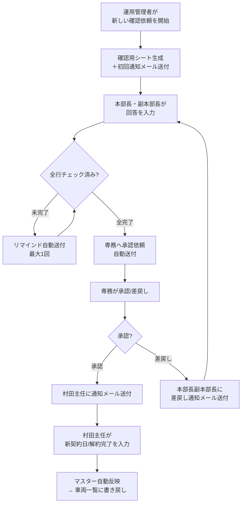

# 車両リース契約更新システム 運用マニュアル

このマニュアルは、車両リース契約の更新通知システムを使うための手順をまとめたものです。

---

# 基本編 ― まず読んでください

## 1. このシステムでできること

「**満了車両の更新/解約を、専務承認付きで一括処理する**」システムです。

1. 半期ごとの対象車両を自動抽出する
2. 本部長・副本部長へ一括で確認依頼メールを出す
3. 締切前に未回答があればリマインドを送る
4. 全件回答完了で専務へ承認依頼を送る
5. 専務の承認後、車両一覧（マスター）へ反映する

リマインドや専務依頼の送信、マスター反映などはトリガー設定済みであれば**自動で進む**ため、普段意識する必要はありません。

---

## 2. 登場人物と役割

| 役割 | 誰か | やること |
| --- | --- | --- |
| **本部長・副本部長** | 各部門の責任者 | 満了車両の「更新」か「解約」かを判断する |
| **専務** | 全社の決定権者 | 本部回答をまとめて「承認」か「差戻し」を判断する |
| **村田主任** | 実務担当者 | 承認済み車両の新契約日や解約完了を入力する |
| **運用管理者** | システム管理者 | 初期セットアップと半期便の実行を行う |
| **台帳管理担当** | 車両データの管理者 | 車両一覧（元台帳）の事実データを管理する |

---

## 3. 全体の流れ

年2回（**3月便** / **9月便**）、この流れで処理します。

| 便名 | 対象期間 | 締切 |
| --- | --- | --- |
| **3月便** | 前年10月1日 〜 当年3月31日満了分 | 3月31日 |
| **9月便** | 4月1日 〜 9月30日満了分 | 9月30日 |

---

## 4. 各担当者の操作手順

### 4.1 本部長・副本部長

1. メールのリンクから「確認用シート」を開く
2. 各車両の「本部回答」を入力する
   - `更新`：契約を継続
   - `解約（入替）`：入替のため解約
   - `解約（満了）`：満了のため解約
3. 入力が終わった行の「回答確認済み」にチェックを入れる

**全行にチェックが入らないと、専務への依頼が送られません。**

### 4.2 専務

1. メールのリンクから「確認用シート」を開く
2. 各車両の「専務判断」を入力する
   - `承認`：本部回答通りに進める
   - `差戻し`：本部へ再検討を求める
3. 必要に応じて「専務コメント」を入れる
4. 全行の判断入力後、各行の「専務確認済み」にチェックを入れる

**全行の判断入力＋全行の「専務確認済み」チェックが揃わないと、判断が確定しません。**

専務判断・専務コメント・専務確認済みの列は保護されており、専務以外は編集できません。

### 4.3 村田主任

承認済みの車両について入力します。

- **更新の場合：** `新契約開始日` と `新契約満了日`
- **解約の場合：** `解約完了` にチェック

### 4.4 運用管理者

**半期ごとにやること：** メニュー「**新しい確認依頼を開始（対象抽出〜初回通知）**」を1回実行するだけです。

あとはトリガーが自動で処理を進めます。「通知ログ」シートで送信結果を適宜確認してください。

---

## 5. 初期セットアップ（最初に1回だけ）

新しくこのシステムを使い始めるとき、運用管理者が次の手順を実行してください。

1. 「設定」シートを開き、必要な設定項目が並んでいることを確認する
2. 「設定」シートで通知先や締切日を入力する（→ [設定項目の一覧](#設定タブの項目)）
3. 保守担当者が `seedSettings()` と `installDailyTriggers()` を実行し、設定ひな形の不足補完とトリガー設定を行う

これで自動進行の定期トリガーが設定され、リマインド送信・専務依頼送信・マスター反映などが自動で動くようになります。  
ここでいう「定期」とは、入力の途中ではなく、数分おきに状態が落ち着いたところで進行可否を見直す、という意味です。
利用者向けメニューには保守項目を出していないため、ここでいう「保守担当者」はスクリプト実行権限を持つ管理者を指します。

---

## 6. やってはいけないこと

- 「通知バッチ」や確認用シートの**ヘッダ名を変更**しない
- `vehicleId` / `batchId` を**手で書き換え**ない
- 専務判断列の**保護設定を外さ**ない

---

# リファレンス編 ― 困ったときに見てください

## シート一覧

| タブ名 | 役割 | 主に見る人 |
| --- | --- | --- |
| **設定** | 通知先・締切日などの運用ルール | 運用管理者 |
| **車両一覧** | 元台帳であり最終反映先でもある唯一の正本 | 台帳管理担当 / システム |
| **通知バッチ** | 半期便の進捗記録 | 運用管理者 |
| **本部長副本部長確認_YYYYMMDD** | 回答・承認の入力画面 | 本部長・副本部長 / 専務 / 村田主任 |
| **要入力** | 元台帳の不備（満了日なし等）の検出ログ | 台帳管理担当 |
| **通知ログ** | メール送信の記録 | 運用管理者 |

---

## 「設定」タブの項目

| 項目名 | 説明 | 例 |
| --- | --- | --- |
| `本部長副本部長_通知先To` | 初回通知・リマインドの送付先 | メールアドレス（カンマ区切りで複数可） |
| `専務_通知先To` | 専務承認依頼の送付先 | メールアドレス |
| `専務_通知先Cc` | 専務依頼のCC（任意） | メールアドレス |
| `村田主任_通知先To` | 村田主任通知の送付先 | メールアドレス |
| `村田主任_通知先Cc` | 村田主任通知のCC（任意） | メールアドレス |
| `半期送付日_3月` / `半期送付日_9月` | 各便の送付日 | 3月1日 / 9月1日 |
| `回答期限_3月` / `回答期限_9月` | 各便の締切日 | 3月31日 / 9月30日 |
| `リマインド_期限前日数` | 締切何日前にリマインドを送るか | 10 |
| `通知_メール送信` | メールを実際に送るか | TRUE / FALSE |
| `自動進行_有効` | 自動進行モードのON/OFF | TRUE / FALSE |
| `自動進行_定期実行_有効` | 定期トリガーで自動進行するか | TRUE / FALSE |
| `自動進行_定期実行_間隔分` | 自動進行を何分おきに判定するか | 10 |
| `自動進行_編集連動_有効` | 旧設定。現行では使用しない | FALSE |
| `自動進行_専務判断反映_有効` | 専務判断反映を自動で行うか | TRUE / FALSE |
| `自動進行_マスター反映_有効` | マスター反映を自動で行うか | TRUE / FALSE |

---

## 困ったときの対応

| 症状 | 確認すること | 対策 |
| --- | --- | --- |
| **メールが来ない** | 「通知ログ」を確認。`通知_メール送信` が FALSE でないか、送信先が空でないか | 設定を修正して再実行 |
| **専務依頼が来ない** | 確認用シートで `本部回答` の空欄や `回答確認済み` の未チェックがないか | 未入力・未チェックを埋めて待つ |
| **マスター反映されない** | 確認用シートの `不正理由` 列に何が残っているか、`専務判断` が「承認」か、更新行に新契約日があるか、解約行に解約完了チェックがあるか | 必須項目を埋めて待つ。急ぎで再判定したい場合は手動で「進行中の確認依頼を再開（最新）」を実行 |

---

## 自動進行の詳細

トリガー設定済みであれば、以下の処理は条件を満たすと自動で実行されます。

自動進行はシート編集のたびに即時起動するのではなく、定期トリガーでまとめて判定します。  
これは、チェックボックス入力の途中状態を拾って誤って次工程へ進まないようにするためです。

| 処理 | 自動で進む条件 |
| --- | --- |
| **リマインド送信** | 期限前日数に到達 かつ 未完了行あり かつ 当バッチで未送信 |
| **専務依頼送信** | 全行で「本部回答」入力済み かつ 全行で「回答確認済み」チェック済み |
| **マスター反映** | 専務判断が「承認」 かつ 必須入力完了（新契約日 または 解約完了チェック） |
| **差戻し通知送信** | 専務判断反映後、差戻し行あり かつ 全行に専務判断入力済み かつ 全行で「専務確認済み」チェック済み |
| **村田主任通知送信** | 専務判断反映後、全件承認 かつ 当バッチで村田主任通知未送信 |
| **村田主任不備通知送信** | 村田主任確認済みの行に反映不可理由があり、前回通知から内容が変わった |
| **村田主任反映完了通知送信** | 今回の自動進行で新たにマスター反映できた行がある |

トリガーが動いていない場合は、保守担当者に `installDailyTriggers()` の再実行を依頼してください。

---

## メニュー項目リファレンス

### トップメニュー

| メニュー項目 | 何をするか |
| --- | --- |
| **運用マニュアル（このシートで見る）** | このマニュアルを表示 |
| **初期車両登録マニュアル（このシートで見る）** | 初回の車両台帳準備手順を表示 |
| **テスト手順書（このシートで見る）** | テスト用の確認観点と手順を表示 |
| **新しい確認依頼を開始（対象抽出〜初回通知）** | 新しい確認依頼を起こし、対象抽出・確認用シート生成・初回通知まで進める |
| **進行中の確認依頼を再開（最新）** | 進行中の最新の確認依頼を再評価し、進められるステップをすべて実行 |

### 保守担当者向けの非表示機能

利用者メニューには出していませんが、保守時には次の関数を使います。

| 関数名 | 何をするか |
| --- | --- |
| `syncSchema()` | 各シートのヘッダ列を最新定義に合わせる |
| `checkSchemaDrift()` | ヘッダやシートの不足を確認する |
| `seedSettings()` | 「設定」シートに初期値を書き込む（初回のみ） |
| `installDailyTriggers()` | 自動進行のトリガーを再設定する |
| `runTestSuite()` | E2Eテストを実行する |
| `cleanupTestData()` | TESTプレフィックスのデータを削除する |
