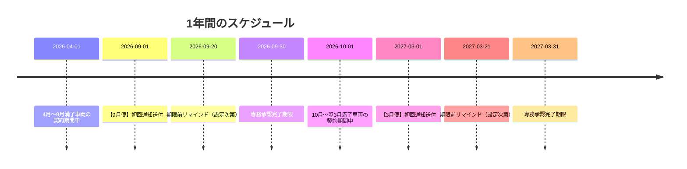
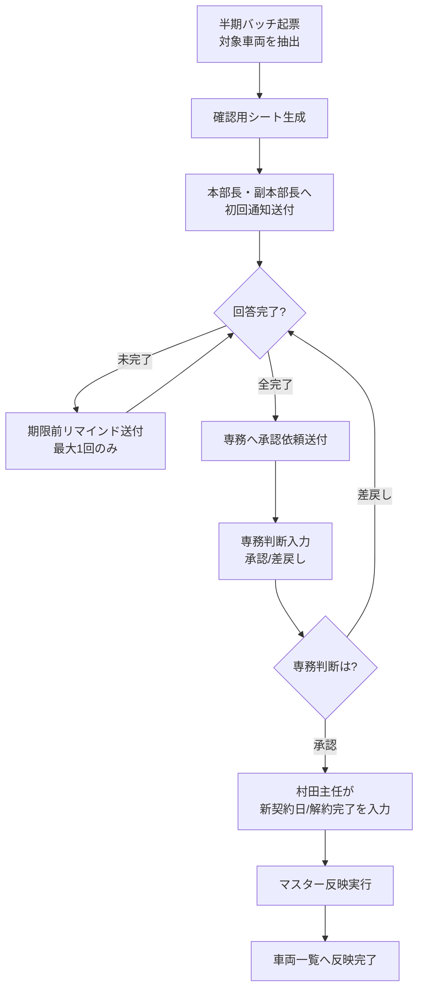

# 車両リース契約更新システム 業務フロー概要

このシステムは、半年に一度やってくる「リース契約の満了車両」について、更新するか解約するかを一括管理するためのものです。

（作成日: 2026-02-12）

---

## 1. 登場人物と役割

| 役割 | 誰か | 主な作業 |
| --- | --- | --- |
| **本部長・副本部長** | 各部門の責任者 | 満了車両について「更新」か「解約」かを判断する |
| **専務** | 全社の決定権者 | 本部回答を一括して「承認」か「差戻し」を判断する |
| **村田主任** | 実務担当者 | 承認済み車両について、新契約日や解約完了を入力する |
| **運用管理者** | システム管理者 | 通知先や締切日などを設定する |
| **台帳管理担当** | 車両データの管理者 | 車両一覧（元台帳）の事実データを管理する |

---

## 2. 1年間のスケジュール

このシステムは**年2回**、3月と9月に稼働します。

### 3月便と9月便の違い

| 便名 | 対象期間 | 満了日がこの期間にある車両 | 締切 |
| --- | --- | --- | --- |
| **3月便** | 10月1日 〜 翌3月31日 | 3月31日 |
| **9月便** | 4月1日 〜 9月30日 | 9月30日 |

---

## 3. 全体フロー図

半期便の処理は、次の順で進みます。

---

## 4. 各ステップの説明

### ステップ1：半期バッチ起票（運用管理者）

- 半期便の識別ID（例: `2026H1`）を作る
- 対象期間の車両を「車両一覧」から自動抽出する
- 抽出結果を「通知バッチ」シートに記録する

### ステップ2：確認用シート生成（自動）

- 抽出した車両で「確認用シート」を作る
- 本部長・副本部長が入力できる形式に整形する

### ステップ3：初回通知送付（自動）

- 本部長・副本部長へメールを送る
- メール本文に確認用シートへのリンクを含める

### ステップ4：本部長・副本部長による回答

- 確認用シートを開く
- 各車両について「更新」「解約（入替）」「解約（満了）」を選ぶ
- 入力が終わった行の「回答確認済み」にチェックを入れる
- **全行にチェックが入らないと、次に進めない**

### ステップ5：リマインド送付（自動・条件付き）

- 締切の設定日数前（例：10日前）に、未完了行が残っている場合のみ送付
- **最大1回だけ**送られる（2回目は送られない）

### ステップ6：専務承認依頼送付（自動）

- **全行の「回答確認済み」にチェックが入ったタイミング**で送付
- 専務へメールを送る

### ステップ7：専務判断入力

- 専務が確認用シートを開く
- 各車両について「承認」か「差戻し」を選ぶ
- 必要に応じてコメントを入れる

### ステップ8：村田主任による最終入力

- **承認された車両**について、次を入力する
  - 更新の場合：新しい契約開始日と満了日
  - 解約の場合：「解約完了」にチェック

### ステップ9：マスター反映（自動 or 手動）

- 入力が完了した車両について、「車両一覧」へ反映する
  - 更新：契約日付を上書きする
  - 解約：その行をグレーアウトする

---

## 5. 自動で進む部分と人が入力する部分

| 項目 | 自動 or 手動 | 補足 |
| --- | --- | --- |
| 対象車両の抽出 | **自動** | 半期バッチ起票で実行 |
| 確認用シートの生成 | **自動** | システムが作る |
| 初回通知の送付 | **自動** | 設定されたタイミングで送付 |
| リマインドの送付 | **自動** | 条件を満たす時のみ |
| 専務承認依頼の送付 | **自動** | 全件確認済みで自動送付 |
| 本部回答の入力 | **手動** | 本部長・副本部長が操作 |
| 専務判断の入力 | **手動** | 専務が操作 |
| 新契約日/解約完了の入力 | **手動** | 村田主任が操作 |
| マスター反映 | **自動 or 手動** | 自動進行ON時は自動 手動実行も可 |
